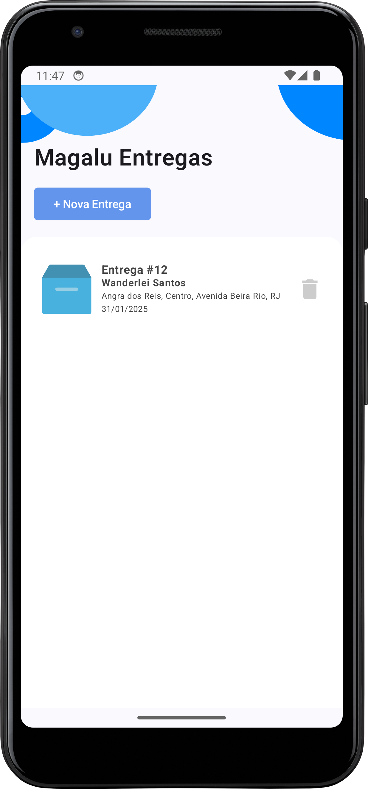
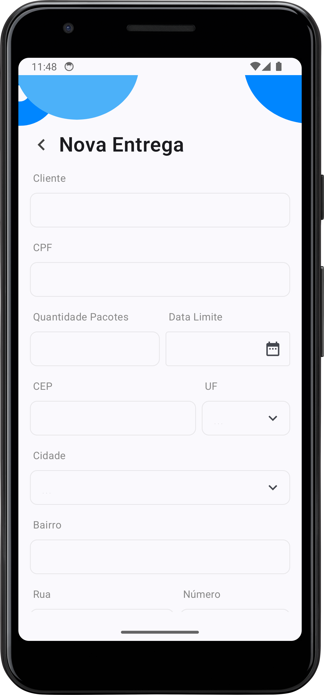
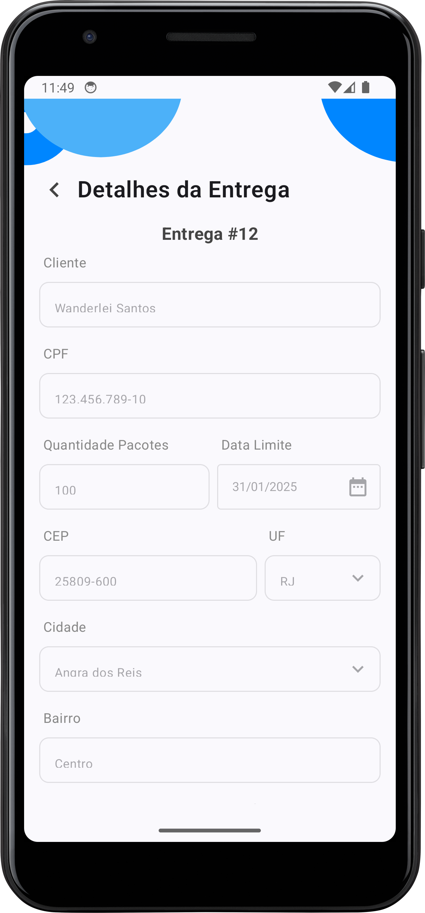
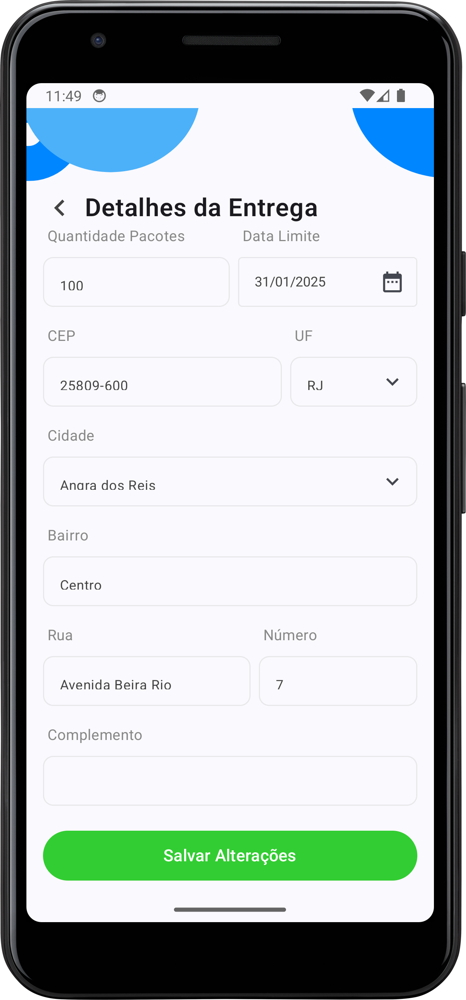

<h1 align="center">
  
</h1>

# Teste Desenvolvedor Mobile Luizalabs

Conclusão do desafio técnico da vaga de Desenvolvedor Mobile.

## 📋 Especificações

Seu desafio é criar um projeto de App Android que permitirá a realização de cadastro de
entregas. O App deverá permitir ao usuário cadastrar, atualizar, visualizar e excluir as entregas.

### Requisitos

- ✅ Implementar `visualização` de entregas;

- ✅ Implementar `cadastro` de entregas;

- ✅ Implementar `atualização` de entregas;

- ✅ Implementar `exclusão` de entregas;

- ✅ Implementar uso de padrão de arquitetura `MVVM`;

- ✅ Implementar persistência com `Room Database Android`;

- ✅ Implementar requisição da listagem de cidades usando `API IBGE`;


## 🛠️ Como rodar o projeto

Antes de rodar o projeto:

- **Android Studio** 
- **JDK 11 ou superior ( utilizei o 21 )**
- **Gradle** (será configurado pelo Android Studio)


Realize o clone do repositório:

```shell
git clone https://github.com/WanderleiSantos/DesafioDesenvolvedorMobile_AppEntregas.git
```
Após o clone do projeto:

- **Abra o projeto no Android Studio** 
- **Clique no botão de Run ou use o atalho Shift + F10.**


## 📱 Screens
<h1 align="center">
  
  
  
  
  
</h1>

## 🧪 Testes


Foi implementado teste unitário na HomeViewModel, mesmo não sendo um requisito prévio;


## 🚀 Tecnologias Utilizadas

- **Kotlin** como linguagem principal
- **Android Jetpack** (Compose, Navigation, ViewModel)
- **Hilt** para injeção de dependência
- **Coroutines** para operações assíncronas
- **Mockk** para testes unitários
- **Material Design 3** para a interface